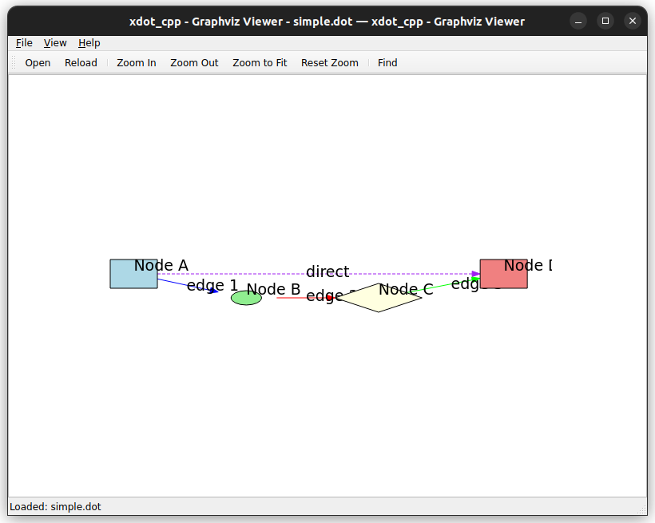
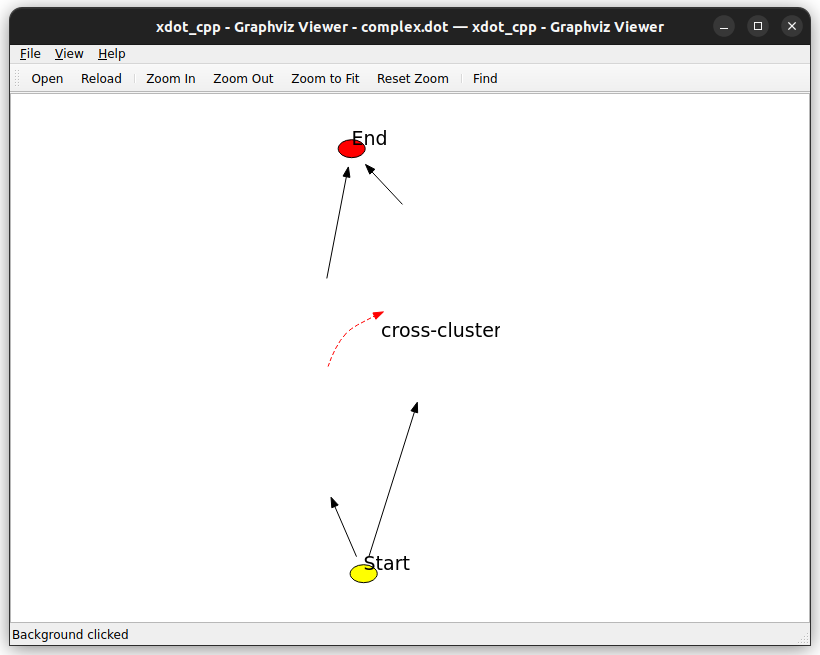

# xdot_cpp

A C++/Qt interactive viewer for graphs written in Graphviz's DOT language, based on the Python xdot.py implementation.

## Features

- **Interactive Graph Viewing**: Pan, zoom, and navigate through DOT graphs
- **DOT Language Support**: Full parser for Graphviz DOT language
- **xdot Format Support**: Native support for xdot extended attributes
- **Qt-based UI**: Modern, cross-platform graphical interface
- **Node/Edge Interaction**: Click handling with URL support
- **Search Functionality**: Find and highlight specific nodes
- **Multiple File Formats**: Support for .dot, .gv, and .xdot files

## Building

### Prerequisites

- C++17 compatible compiler (GCC 7+, Clang 5+, MSVC 2017+)
- Qt6 (Core, Widgets, Gui modules)
- CMake 3.16+
- Optional: Graphviz (for processing .dot files)

### Build Instructions

```bash
# Clone the repository
git clone <repository-url>
cd xdot_cpp

# Create build directory
mkdir build
cd build

# Configure with CMake
cmake ..

# Build
make -j$(nproc)

# Install (optional)
make install
```

### Build Options

- `BUILD_SHARED_LIBS=ON`: Build as shared library
- `CMAKE_BUILD_TYPE=Debug`: Build with debug information

## Usage

### GUI Application

```bash
# Launch with no file
./xdot_viewer

# Open a specific file
./xdot_viewer examples/simple.dot

# Use specific Graphviz filter
./xdot_viewer -f neato examples/complex.dot
```




### Keyboard Shortcuts

- `Ctrl+O`: Open file
- `F5` or `Ctrl+R`: Reload file
- `Ctrl+F`: Find node
- `Ctrl++`: Zoom in
- `Ctrl+-`: Zoom out
- `Ctrl+0`: Zoom to fit
- `Ctrl+1`: Reset zoom
- `Escape`: Close find dialog

### Mouse Controls

- **Left Click**: Select nodes/edges, pan when dragging
- **Ctrl+Wheel**: Zoom in/out
- **Wheel**: Scroll

## Library Usage

xdot_cpp can also be used as a library:

```cpp
#include <xdot_cpp/xdot_cpp.h>

// Parse DOT code
xdot_cpp::dot::DotLexer lexer(dot_code);
xdot_cpp::dot::DotParser parser(lexer.tokenize());
auto graph = parser.parse();

// Parse xdot attributes
xdot_cpp::xdot::XDotAttrParser xdot_parser(xdot_data);
auto shapes = xdot_parser.parse();

// Create Qt widget
auto widget = new xdot_cpp::ui::DotWidget();
widget->set_dot_code(dot_code);
```

## Architecture

The library is organized into several modules:

### DOT Parser (`xdot_cpp::dot`)
- **Lexer**: Tokenizes DOT language input
- **Parser**: Builds Abstract Syntax Tree from tokens
- **AST**: Represents graph structure (nodes, edges, attributes)

### xdot Parser (`xdot_cpp::xdot`)
- **XDotAttrParser**: Parses xdot drawing attributes
- **Elements**: Shape classes (ellipse, polygon, text, etc.)
- **Color**: Color handling and named color support
- **Graph**: High-level graph representation

### UI Components (`xdot_cpp::ui`)
- **DotWidget**: Qt widget for rendering graphs
- **DotWindow**: Main application window
- **QtRenderer**: Qt-specific rendering implementation

## File Format Support

### DOT Files (.dot, .gv)
Standard Graphviz DOT format. Requires Graphviz installation for full rendering.

### xdot Files (.xdot)
Extended DOT format with embedded drawing instructions. Can be rendered without Graphviz.

## Examples

See the `examples/` directory for sample DOT files:

- `simple.dot`: Basic graph with different node shapes and colors
- `complex.dot`: Advanced graph with clusters and styling

## Comparison with xdot.py

| Feature | xdot.py | xdot_cpp |
|---------|---------|----------|
| Language | Python | C++ |
| GUI Framework | GTK | Qt |
| Performance | Moderate | High |
| Memory Usage | Higher | Lower |
| Startup Time | Slower | Faster |
| Platform Support | Linux/Unix | Cross-platform |

## Contributing

1. Fork the repository
2. Create a feature branch
3. Make your changes
4. Add tests if applicable
5. Submit a pull request

## License

This project is licensed under the MIT License - see the LICENSE file for details.

## Acknowledgments

- Based on the original xdot.py by Jose Fonseca
- Inspired by the Graphviz project
- Uses Qt for cross-platform GUI support